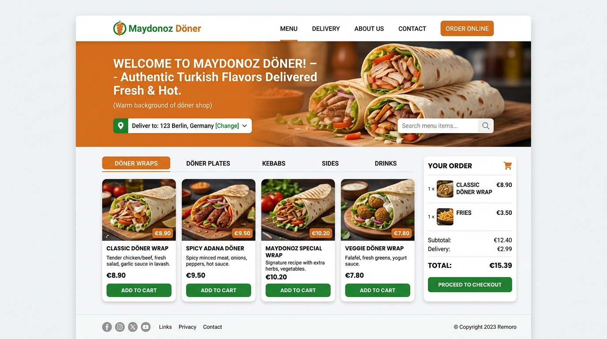

# Maydonoz Döner - Şube ve Menü Yönetim Sistemi

Maydonoz Döner restoran zinciri için tasarlanmış, menüleri, şubeleri, kampanyaları ve müşteri geri bildirimlerini dinamik olarak yönetebilen web sitesi uygulamasıdır.

## 🚀 Kullanılan Teknolojiler
* **Mimari:** ASP.NET Core MVC
* **Veri Tabanı / ORM:** Entity Framework Core (Code-First) & SQL Server
* **Tasarım:** HTML, CSS, JavaScript, Bootstrap, wwwroot statik varlıkları

## ✨ Özellikler / Yapı
* Admin paneli üzerinden menü kalemleri ekleme, güncelleme ve fiyat belirleme.
* Şubelerin listelenmesi ve şube detaylarının dinamik yönetimi.
* Müşterilerden gelen mesajların veritabanında saklanması.

## 🛠️ Nasıl Çalıştırılır?
1. `appsettings.json` içindeki Connection String bilgisini yerel SQL Server ayarlarınızla güncelleyin.
2. `Update-Database` komutu ile veritabanını oluşturun.
3. Projeyi başlatın.
